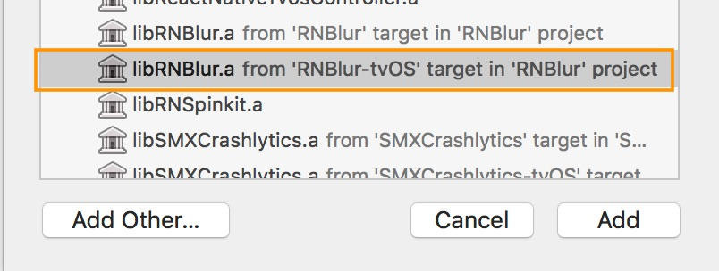

[](https://badge.fury.io/js/react-native-blur)

### React Native Blur

A component for UIVisualEffectView's blur and vibrancy effect on iOS, and [500px-android-blur](https://github.com/500px/500px-android-blur) on Android.<br>


### Content

- [Installation](#installation)
- [BlurView](#blurview)
- [VibrancyView](#vibrancyview)
- [Example React Native app](#example-react-native-app)
- [Questions?](#questions)


### Installation

**NOTE:** Latest version of the package is available in npm as `react-native-blur@3.0.0-alpha`

1. Install package via npm:

  ```
  npm install react-native-blur
  ```

2. Link your native dependencies:
  ```
  react-native link react-native-blur
  ```

3. (Android only) Add the following to `android/app/build.gradle`

```
android {
    // make sure to use 23.0.3 instead of 23.0.1
    buildToolsVersion '23.0.3'

    // ...
    defaultConfig {
        // Add these lines below the existing config
        renderscriptTargetApi 23
        renderscriptSupportModeEnabled true
    }
}
```

4. Include the library in your code:

  ```javascript
  import { BlurView, VibrancyView } from 'react-native-blur';

  // OR

  const { BlurView, VibrancyView } = require('react-native-blur');
  ```

5. Compile and have fun!


### BlurView

**Properties:**

- `blurType` (String)
  - `xlight` - extra light blur type
  - `light` - light blur type
  - `dark` - dark blur type
  - `extraDark` - extra dark blur type (tvOS only)
  - `regular` - regular blur type (tvOS only)
  - `prominent` - prominent blur type (tvOS only)
- `blurAmount` (Default: 10, Number)
  - `0-100` - Adjusts blur intensity

> Note: The maximum `blurAmount` on Android is 32, so higher values will be clamped to 32.

> Complete usage example that works on iOS and Android:

```javascript
import React, { Component } from 'react';
import { View, Image, Text, findNodeHandle, StyleSheet } from 'react-native';
import { BlurView } from 'react-native-blur';

export default class Menu extends Component {
  constructor(props) {
    super(props);
    this.state = { viewRef: null };
  }

  imageLoaded() {
    this.setState({ viewRef: findNodeHandle(this.backgroundImage) });
  }

  render() {
    return (
      <View style={styles.container}>
        <Image
          ref={(img) => { this.backgroundImage = img; }}
          source={{uri}}
          style={styles.absolute}
          onLoadEnd={this.imageLoaded.bind(this)}
        />
        <BlurView
          style={styles.absolute}
          viewRef={this.state.viewRef}
          blurType="light"
          blurAmount={10}
        />
        <Text>Hi, I am some unblurred text</Text>
      </View>
    );
  }
}

const styles = StyleSheet.create({
  container: {
    justifyContent: 'center',
    alignItems: 'center',
  },
  absolute: {
    position: "absolute",
    top: 0, left: 0, bottom: 0, right: 0,
  },
});
```

In this example, the `Image` component will be blurred, because the `BlurView` in positioned on top. But the `Text` will stay unblurred.

Note that `viewRef` is only required if you need to support Android. See the [Android section](#android) for more details.

### VibrancyView

**Uses the same properties as `BlurView` (`blurType` and `blurAmount`).**

> The vibrancy effect lets the content underneath a blurred view show through more vibrantly

> (Note: `VibrancyView` is only supported on iOS. Also note that the `VibrancyView` must contain nested views.)

```javascript
import { VibrancyView } from 'react-native-blur';

export default class Menu extends Component {
  render() {
    return (
      <Image source={{uri}} style={styles.absolute}>
        <VibrancyView blurType="light" style={styles.flex}>
          <Text>Hi, I am some vibrant text.</Text>
        </VibrancyView>
      </Image>
    );
  }
}
```

### Android

Android uses the [500px-android-blur](https://github.com/500px/500px-android-blur) library, which works by blurring a referenced view. This means that you must wait until the view you want to blur is rendered. You then use `findNodeHandle` to get a reference to that view, and pass that reference to the `BlurView` as the `viewRef` prop. Take a look at [the BlurView example](#blurview) to see how it works.

The Android library introduces some limitations:

* `BlurView` cannot be a child of the view that is being blurred (this would cause an infinite loop)
* `BlurView` cannot contain any child components.

If you only need to support iOS, then you can safely ignore these limitations.

In addition to `blurType` and `blurAmount`, Android has some extra props that can be used to override the default behavior (or configure Android-specific behavior):

- `blurRadius`       (Number - between 0 and 25) - Manually adjust the blur radius. (Default: matches iOS blurAmount)
- `downsampleFactor` (Number - between 0 and 25) - Scales down the image before blurring (Default: matches iOS blurAmount)
- `overlayColor`     (Color) - Set a custom overlay color (Default color based on iOS blurType)


### Example React Native App

This project includes an example React Native app, which was used to make the GIF in this README.
You can run the apps by following these steps:

1. Clone the repository

```
cd ~
git clone https://github.com/react-native-community/react-native-blur.git
```

2. cd to `examples/Basic`

```
cd react-native-blur/examples/Basic
```

3. Install dependencies

```
npm install
```

4. Run the apps:

#### Run the iOS app

```
react-native run-ios
```

#### Run the tvOS app

type:
```
react-native run-ios
```

`react-native link` don’t works properly with the tvOS target so we need to add the library manually.

First select your project in Xcode.


After that, select the tvOS target of your application and select « General » tab


Scroll to « Linked Frameworks and Libraries » and tap on the + button


Select RNBlur-tvOS



That’s all, you can use react-native-blur for your tvOS application

#### Run the Android app

```
react-native run-android
```


### Troubleshooting

On older instances of react-native, BlurView package does not get added into the MainActivity/MainApplication classes where you would see `Warning: Native component for 'BlurView' does not exist` in RN YellowBox or console.

To rectify this, you can add the BlurViewPackage manually in MainActivity/MainApplication classes
```java
...
import com.cmcewen.blurview.BlurViewPackage;
...

public class MainApplication extends Application implements ReactApplication {
...
    @Override
    protected List<ReactPackage> getPackages() {
      return Arrays.<ReactPackage>asList(
          new MainReactPackage(),
          new BlurViewPackage()
      );
    }
...
}
```


### Questions?

Feel free to contact me in [twitter](https://twitter.com/kureevalexey) or [create an issue](https://github.com/Kureev/react-native-blur/issues/new)
